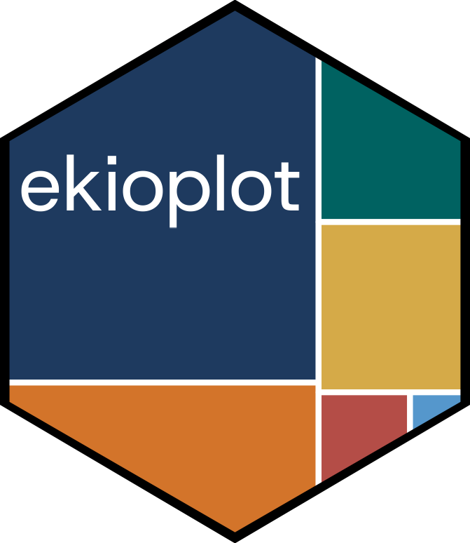
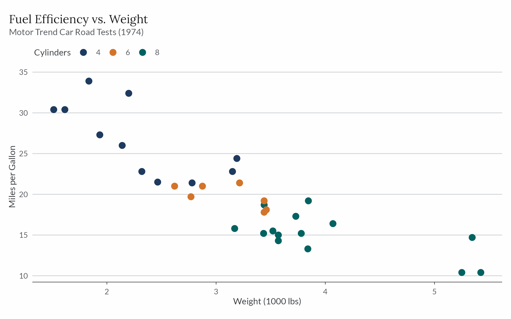
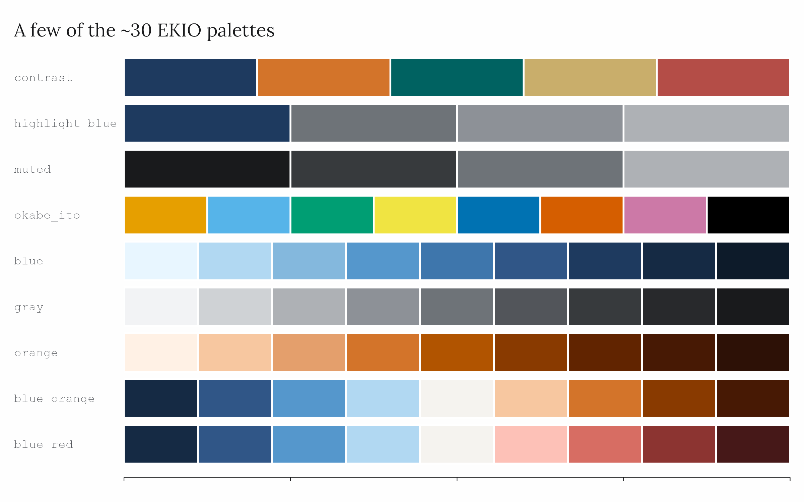
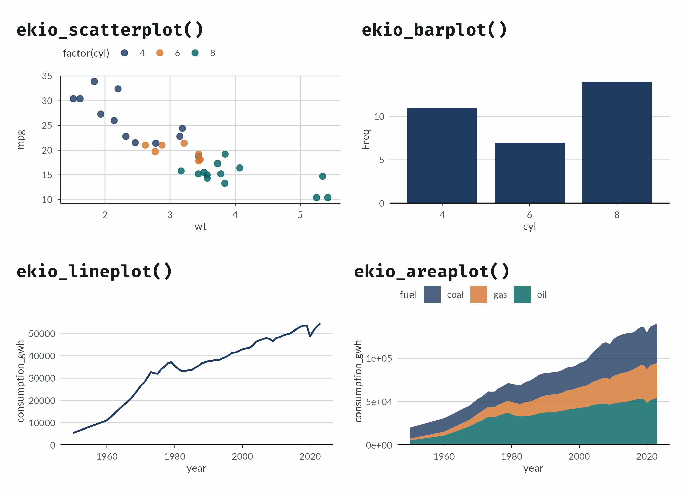

<!-- README.md is generated from README.Rmd. Edit the .Rmd, then run -->
<!-- `Rscript data-raw/readme-plots.R` and `devtools::build_readme()`.  -->

```{r setup, include = FALSE}
knitr::opts_chunk$set(
  collapse = TRUE,
  comment = "#>",
  eval = FALSE
)
```

# ekioplot 

<!-- badges: start -->
[](https://lifecycle.r-lib.org/articles/stages.html#experimental)
[](https://viniciusoike.r-universe.dev/ekioplot)
[](https://github.com/viniciusoike/ekioplot/actions/workflows/R-CMD-check.yaml)
<!-- badges: end -->

## Overview

`ekioplot` implements EKIO's visual identity system for data visualization in
R.

```{r hero-show, eval = FALSE}
library(ekioplot)
library(ggplot2)

ggplot(mtcars, aes(wt, mpg, color = factor(cyl))) +
  geom_point(size = 3) +
  scale_color_ekio_d("contrast") +
  labs(
    title = "Fuel Efficiency vs. Weight",
    subtitle = "Motor Trend Car Road Tests (1974)",
    x = "Weight (1000 lbs)",
    y = "Miles per Gallon",
    color = "Cylinders"
  ) +
  theme_ekio()
```



## Installation

`ekioplot` is not on CRAN. Install from
[r-universe](https://viniciusoike.r-universe.dev/ekioplot):

```{r}
install.packages("ekioplot", repos = "https://viniciusoike.r-universe.dev")
```

Or install the development version from GitHub.

```{r}
# install.packages("pak")
pak::pak("viniciusoike/ekioplot")
```

## Themes

`theme_ekio()` applies EKIO's visual identity to any ggplot2 plot, building on
`theme_minimal()` with curated typography, spacing, and color. The `grid`
argument controls which major grid lines are drawn (`"y"`, `"x"`, `"xy"`, or
`"none"`).

```{r}
theme_ekio(grid = "xy")
```

## Color palettes

ekioplot ships palettes across six groups, all accessible through a single
function. The eight brand scales are generated from one OKLCH specification,
so a given shade carries the same visual weight in every family.

```{r}
ekio_pal()
```



## Scales

Discrete and continuous scales are provided for both `color` and `fill`.

```{r}
# Discrete (categorical palettes)
scale_color_ekio_d("contrast")
scale_fill_ekio_d("cool")

# Continuous (sequential / diverging palettes)
scale_color_ekio_c("blue")
scale_fill_ekio_c("blue_orange")
```

## Recipe functions

High-level builders create complete, publication-ready plots with smart
defaults.



## See more

See `vignette("getting-started", package = "ekioplot")` and the package
website at <https://viniciusoike.github.io/ekioplot/>.

---
