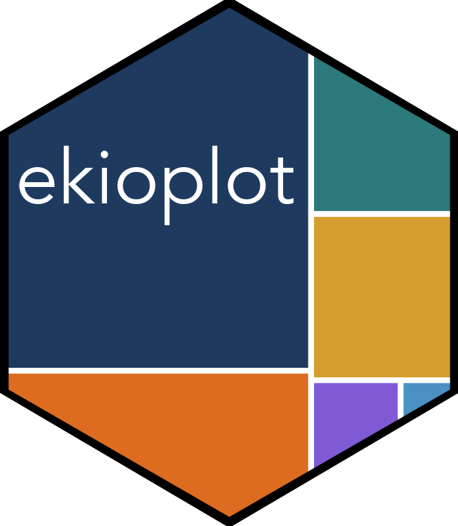
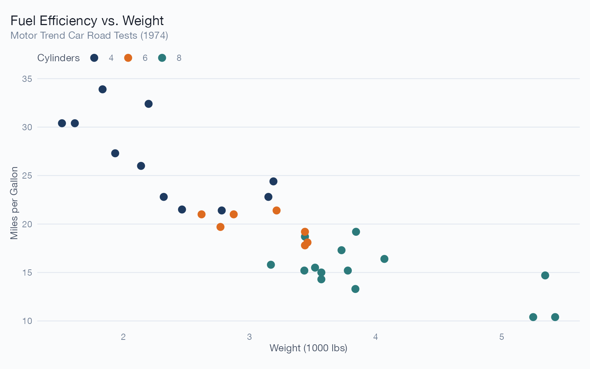
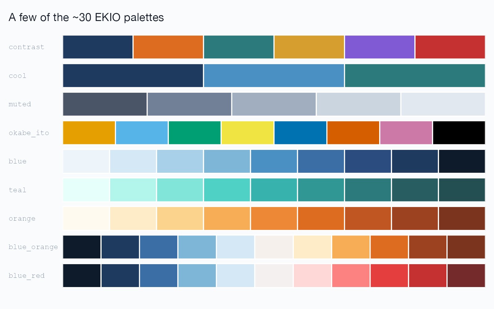
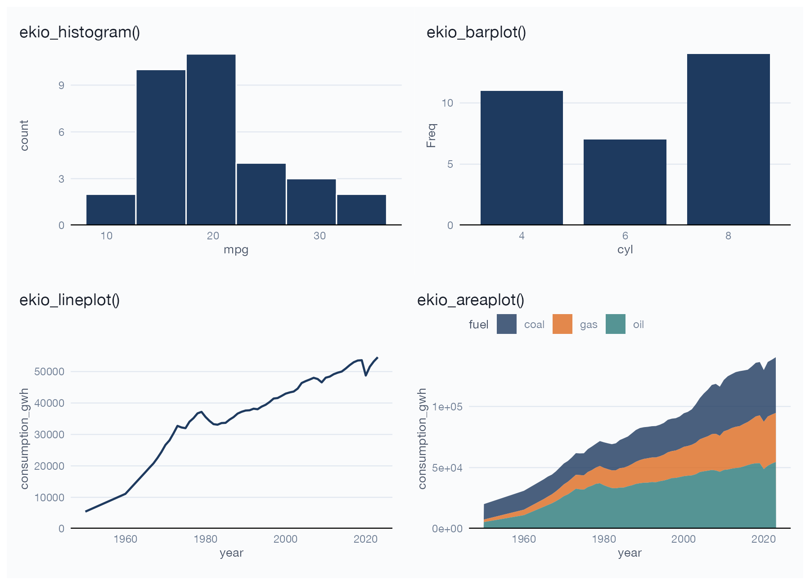

<!-- README.md is generated from README.Rmd. Edit the .Rmd, then run -->

<!-- `Rscript data-raw/readme-plots.R` and `devtools::build_readme()`.  -->

# ekioplot 

<!-- badges: start -->

[](https://lifecycle.r-lib.org/articles/stages.html#experimental)
[](https://viniciusoike.r-universe.dev/ekioplot)
[](https://github.com/viniciusoike/ekioplot/actions/workflows/R-CMD-check.yaml)
<!-- badges: end -->

## Overview

`ekioplot` implements EKIO’s visual identity system for data
visualization in R. It provides a professional ggplot2 theme, curated
color palettes and scale functions, high-level “recipe” chart builders,
and a matching theme for `gt` tables — all following EKIO design
principles of clarity, purposeful color, and professional presentation.

``` r
library(ekioplot)
library(ggplot2)

ggplot(mtcars, aes(wt, mpg, color = factor(cyl))) +
  geom_point(size = 3) +
  scale_color_ekio_d("contrast") +
  labs(
    title = "Fuel Efficiency vs. Weight",
    subtitle = "Motor Trend Car Road Tests (1974)",
    x = "Weight (1000 lbs)",
    y = "Miles per Gallon",
    color = "Cylinders"
  ) +
  theme_ekio()
```



## Installation

`ekioplot` is not on CRAN. Install the pre-built binary from
[r-universe](https://viniciusoike.r-universe.dev/ekioplot):

``` r
install.packages("ekioplot", repos = "https://viniciusoike.r-universe.dev")
```

Or install the development version from GitHub:

``` r
# install.packages("pak")
pak::pak("viniciusoike/ekioplot")
```

## Themes

`theme_ekio()` applies EKIO’s visual identity to any ggplot2 plot,
building on `theme_minimal()` with curated typography, spacing, and
color. The `grid` argument controls which major grid lines are drawn
(`"y"`, `"x"`, `"xy"`, or `"none"`):

``` r
theme_ekio(grid = "xy")
```

Use `theme_ekio_map()` for choropleths and spatial maps — it removes the
axes and repositions the legend.

## Color palettes

ekioplot ships ~30 palettes across five categories, all accessible
through a single function:

``` r
list_ekio_palettes()        # explore everything, grouped by type
ekio_pal("contrast")        # categorical
ekio_pal("blue", n = 5)     # sequential, interpolated to 5 colors
show_ekio_palette("contrast")
```



- **Categorical**: `contrast`, `cool`, `minimal`, `full`, `muted`,
  `binary`, `political`
- **Small-group**: `duo_warm`, `duo_cool`, `trio_bold`, `trio_cool`,
  `quad_earth`, `quad_vivid`
- **Scientific**: `okabe_ito`, `viridis`, `inferno`, `plasma`
- **Sequential**: `blue`, `teal`, `gray`, `orange`, `purple`, `red`,
  `green`, `amber`
- **Diverging**: `blue_orange`, `blue_red`, `teal_orange`

Named color vectors (`ekio_blue`, `ekio_gray`, `ekio_teal`,
`ekio_orange`) provide 10 shades each (`"50"` lightest to `"900"`
darkest) for direct use, plus `ekio_accent` for individual accent
colors.

## Scales

Discrete and continuous scales are provided for both `color` and `fill`
(British-spelling aliases included):

``` r
# Discrete (categorical palettes)
scale_color_ekio_d("contrast")
scale_fill_ekio_d("cool")

# Continuous (sequential / diverging palettes)
scale_color_ekio_c("blue")
scale_fill_ekio_c("blue_orange")
```

## Recipe functions

High-level builders create complete, publication-ready plots with smart
defaults. They automatically detect whether the `color`/`fill` argument
is missing (uses EKIO blue), a color string (used directly), or a
variable (mapped with the appropriate EKIO scale):

``` r
ekio_histogram(mtcars, mpg)
ekio_histogram(mtcars, mpg, fill = "coral")
ekio_scatterplot(mtcars, wt, mpg, color = factor(cyl))
ekio_barplot(cyl_counts, cyl, n)
ekio_lineplot(ggplot2::economics, date, unemploy)

world_fuels <- subset(fuels, entity == "World" & year >= 1950)
ekio_areaplot(world_fuels, year, consumption_gwh, fill = fuel)
```



## GT tables

``` r
library(gt)

head(mtcars[, 1:5], 8) |>
  gt() |>
  gt_theme_ekio()
```

## Palette Lab

The **Palette Lab** is an interactive app for building and comparing
palettes across many chart types, with color-vision-deficiency
simulation and contrast checks. It runs entirely in your browser at
<https://viniciusoike.github.io/ekioplot-palette-lab/> and its source
lives in a separate repository:
<https://github.com/viniciusoike/ekioplot-palette-lab>.

## Learn more

See `vignette("getting-started", package = "ekioplot")` and the package
website at <https://viniciusoike.github.io/ekioplot/>.

------------------------------------------------------------------------

*EKIO*
