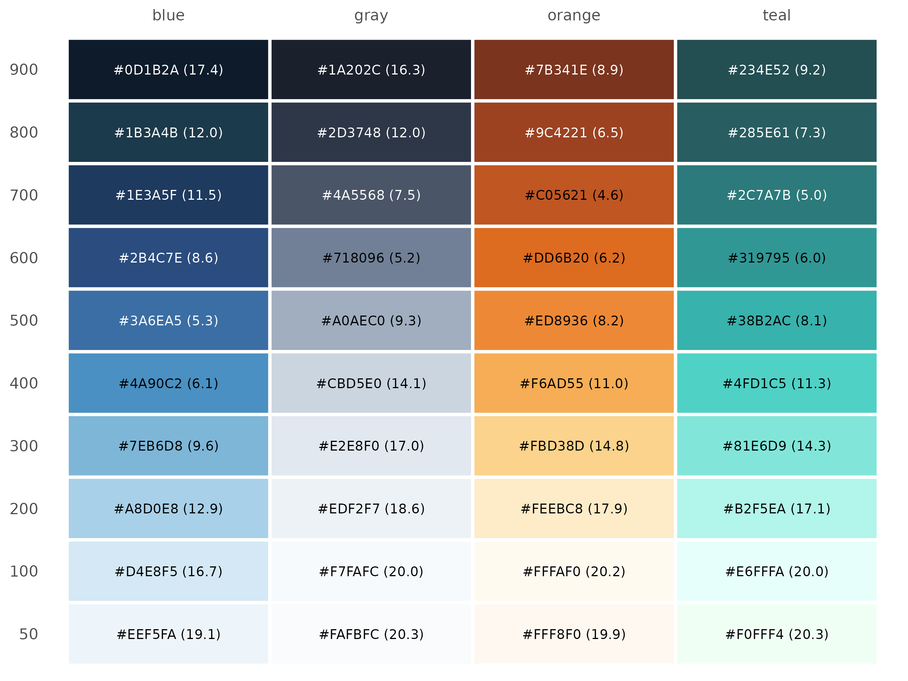
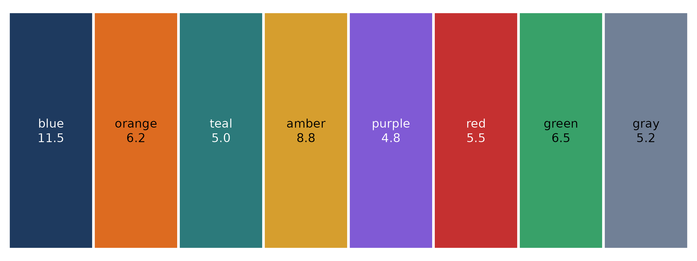
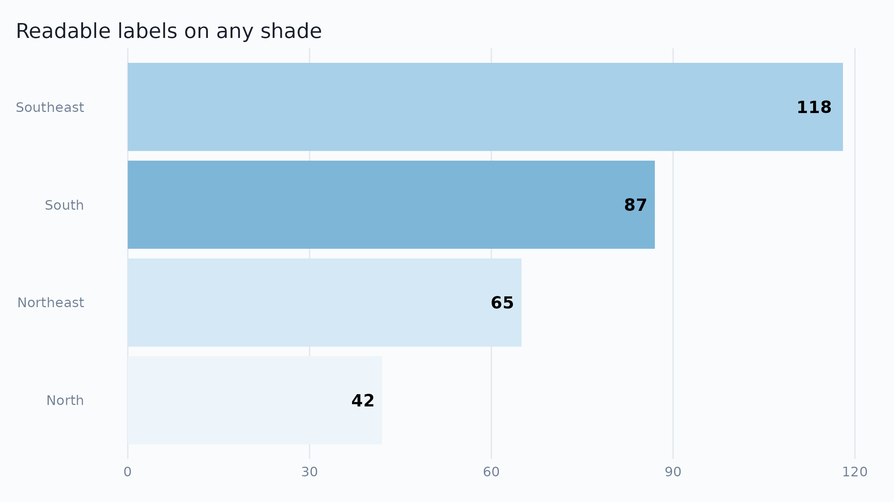

# Color accessibility

``` r

library(ekioplot)
library(ggplot2)
```

Text placed on a colored background — bar labels, gt table cells,
annotation boxes — needs enough contrast to stay readable. The [WCAG
2.1](https://www.w3.org/TR/WCAG21/#contrast-minimum) guidelines quantify
this as a **contrast ratio** between text and background, from 1
(identical colors) to 21 (black on white):

| Level | Normal text | Large text (≥ 18pt) |
|-------|-------------|---------------------|
| AA    | ≥ 4.5       | ≥ 3.0               |
| AAA   | ≥ 7.0       | ≥ 4.5               |

`ekioplot` provides two helpers:

- [`ekio_contrast()`](https://viniciusoike.github.io/ekioplot/reference/ekio_contrast.md)
  computes the WCAG contrast ratio between two colors.
- [`ekio_text_on()`](https://viniciusoike.github.io/ekioplot/reference/ekio_text_on.md)
  picks the more readable text color (black or white) for a given
  background.

``` r

ekio_contrast("white", ekio_blue["700"])
#> [1] 11.50262
ekio_text_on(ekio_blue["700"])
#>     700 
#> "white"
```

## Black or white text on the EKIO scales

The chart below shows every shade of the four EKIO color scales, labeled
in the text color that
[`ekio_text_on()`](https://viniciusoike.github.io/ekioplot/reference/ekio_text_on.md)
selects, with its contrast ratio in parentheses.

``` r

scales_df <- do.call(rbind, lapply(
  c("blue", "teal", "orange", "gray"),
  function(scale_name) {
    hex <- get(paste0("ekio_", scale_name))
    data.frame(
      scale = scale_name,
      shade = factor(names(hex), levels = rev(names(hex))),
      hex = unname(hex)
    )
  }
))

scales_df$text_color <- ekio_text_on(scales_df$hex)
scales_df$ratio <- ifelse(
  scales_df$text_color == "white",
  ekio_contrast("white", scales_df$hex),
  ekio_contrast("black", scales_df$hex)
)
scales_df$label <- sprintf(
  "%s (%.1f)", scales_df$hex, scales_df$ratio
)

ggplot(scales_df, aes(x = scale, y = shade, fill = hex)) +
  geom_tile(color = "white", linewidth = 1) +
  geom_text(aes(label = label, color = text_color), size = 3) +
  scale_fill_identity() +
  scale_color_identity() +
  scale_x_discrete(position = "top") +
  labs(x = NULL, y = NULL) +
  theme_minimal(base_size = 12) +
  theme(panel.grid = element_blank())
```



The pattern is consistent across scales: shades **500 and darker take
white text**, shades **400 and lighter take black text**. When in doubt,
call
[`ekio_text_on()`](https://viniciusoike.github.io/ekioplot/reference/ekio_text_on.md)
instead of memorizing the cutoff.

## Accent colors

The named accent colors in `ekio_accent` are mid-to-dark tones, so most
of them pair with white text — but not all reach AA for normal-size
text.

``` r

accents_df <- data.frame(
  name = factor(names(ekio_accent), levels = names(ekio_accent)),
  hex = unname(ekio_accent)
)
accents_df$text_color <- ekio_text_on(accents_df$hex)
accents_df$ratio <- ekio_contrast(accents_df$text_color, accents_df$hex)
accents_df$label <- sprintf("%s\n%.1f", accents_df$name, accents_df$ratio)

ggplot(accents_df, aes(x = name, y = 1, fill = hex)) +
  geom_tile(color = "white", linewidth = 1) +
  geom_text(aes(label = label, color = text_color), size = 3.5, lineheight = 1) +
  scale_fill_identity() +
  scale_color_identity() +
  labs(x = NULL, y = NULL) +
  theme_void()
```



A full compliance table:

``` r

accents_df$aa <- accents_df$ratio >= 4.5
accents_df$aa_large <- accents_df$ratio >= 3.0
accents_df$aaa <- accents_df$ratio >= 7.0

accents_df[, c("name", "hex", "text_color", "ratio", "aa", "aa_large", "aaa")]
#>     name     hex text_color     ratio   aa aa_large   aaa
#> 1   blue #1E3A5F      white 11.502620 TRUE     TRUE  TRUE
#> 2 orange #DD6B20      black  6.198365 TRUE     TRUE FALSE
#> 3   teal #2C7A7B      white  5.027628 TRUE     TRUE FALSE
#> 4  amber #D69E2E      black  8.789424 TRUE     TRUE  TRUE
#> 5 purple #805AD5      white  4.837457 TRUE     TRUE FALSE
#> 6    red #C53030      white  5.469427 TRUE     TRUE FALSE
#> 7  green #38A169      black  6.470082 TRUE     TRUE FALSE
#> 8   gray #718096      black  5.230212 TRUE     TRUE FALSE
```

Colors that pass `aa_large` but not `aa` (such as `orange` and `amber`
with white text) are fine for large display text — big value labels,
headline numbers — but should not carry small annotations. For small
text on those fills, use a dark text color such as `ekio_gray["900"]`:

``` r

ekio_contrast(ekio_gray["900"], ekio_accent["amber"])
#> [1] 6.829936
```

## Using `ekio_text_on()` in plots

Pass the fill colors through
[`ekio_text_on()`](https://viniciusoike.github.io/ekioplot/reference/ekio_text_on.md)
to color labels, so they stay readable regardless of the underlying
shade:

``` r

sales <- data.frame(
  region = c("North", "Northeast", "Southeast", "South"),
  value = c(42, 65, 118, 87)
)
sales$fill <- ekio_pal("blue", n = 4)

ggplot(sales, aes(x = reorder(region, value), y = value, fill = fill)) +
  geom_col() +
  geom_text(
    aes(label = value, color = ekio_text_on(fill)),
    hjust = 1.3,
    fontface = "bold"
  ) +
  scale_fill_identity() +
  scale_color_identity() +
  coord_flip() +
  labs(x = NULL, y = NULL, title = "Readable labels on any shade") +
  theme_ekio(grid = "x")
```



## Guidelines

- Default to `ekio_blue["700"]` (the primary brand blue) for filled
  elements that carry white text: it passes AAA (ratio 11.5).
- Light backgrounds (`50`–`200` shades) are for panels and subtle fills;
  always use dark text on them.
- Don’t rely on the black/white cutoff from memory when generating fills
  programmatically — compute it with
  [`ekio_text_on()`](https://viniciusoike.github.io/ekioplot/reference/ekio_text_on.md).
- Contrast ratios apply to text and essential icons, not to adjacent
  chart fills; for distinguishing series, palette choice (see
  [`ekio_pal()`](https://viniciusoike.github.io/ekioplot/reference/ekio_pal.md))
  matters more than contrast against the background.
