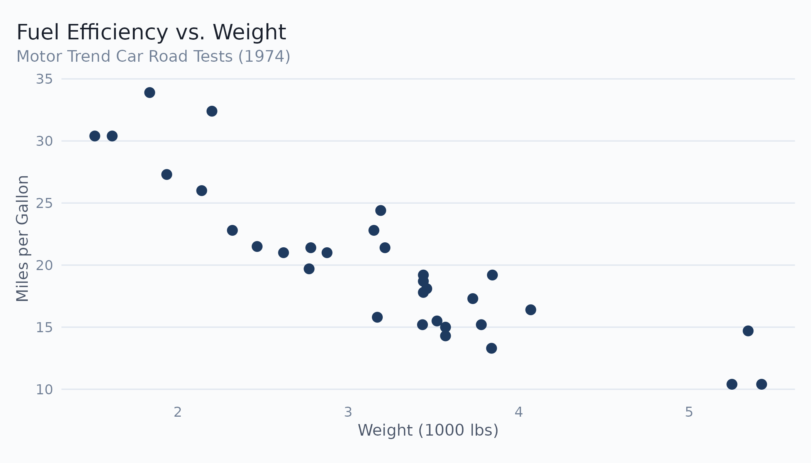
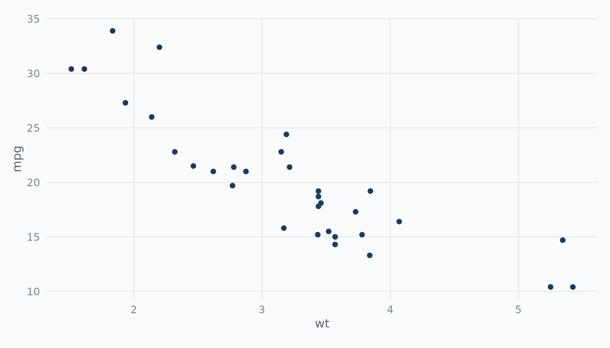
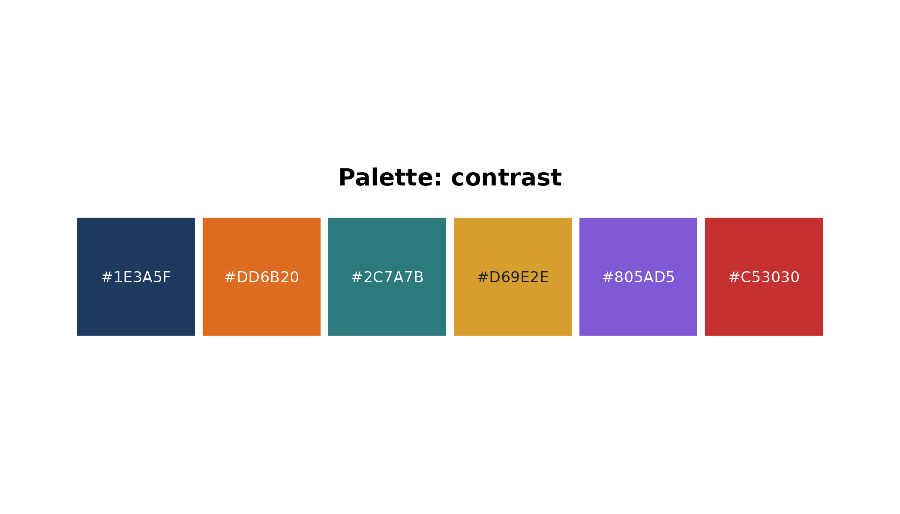
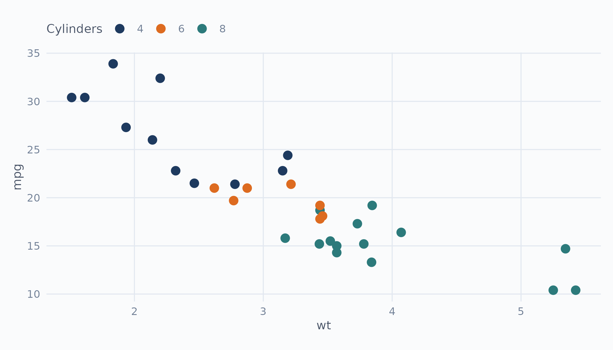
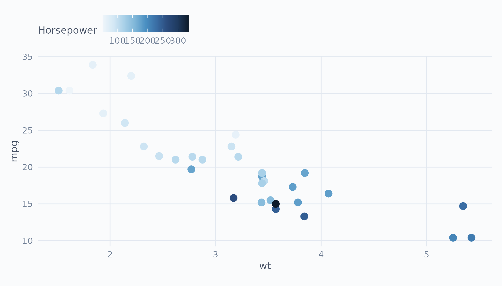
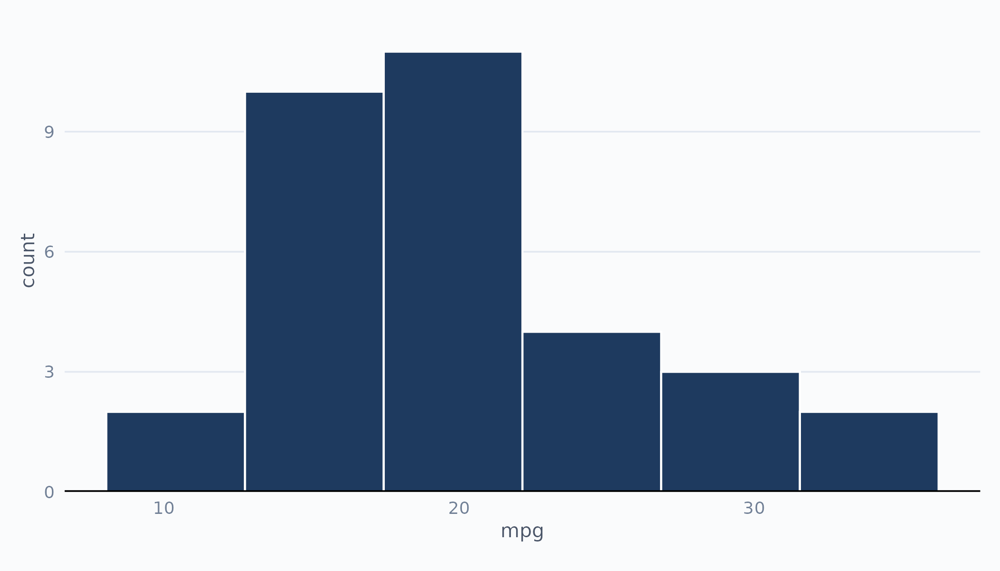
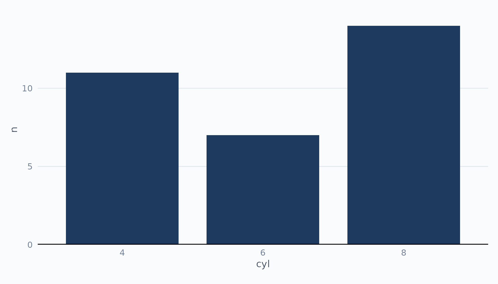
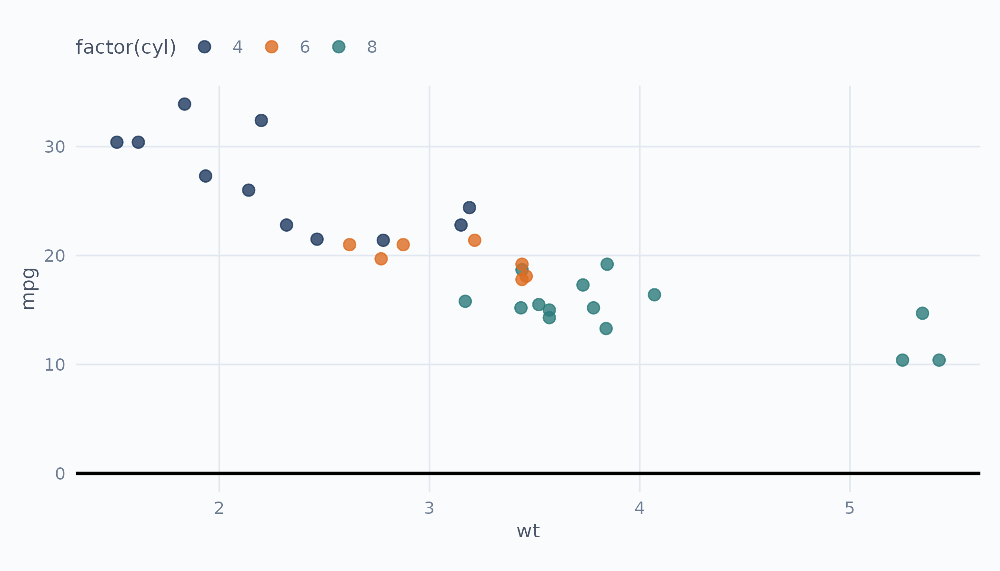
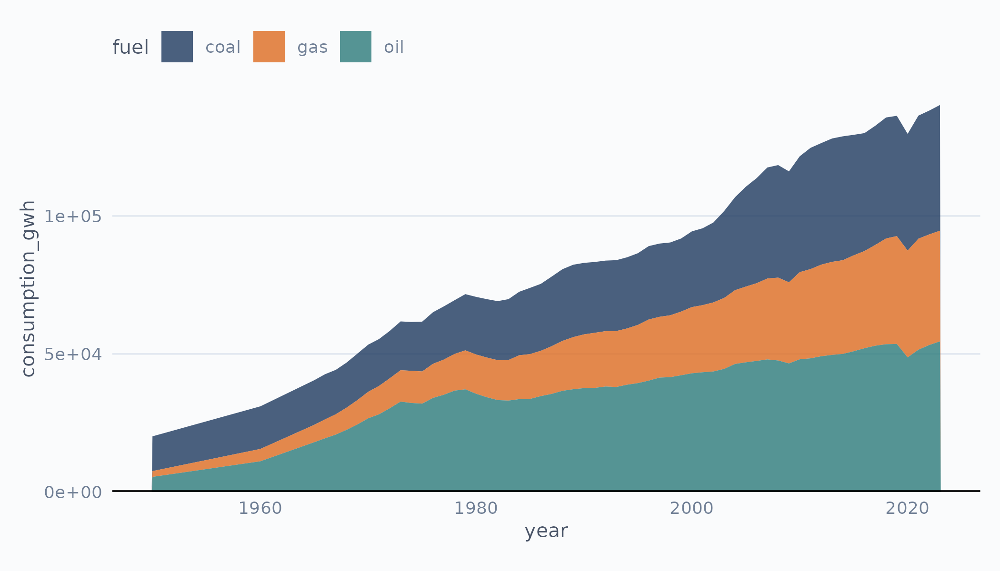
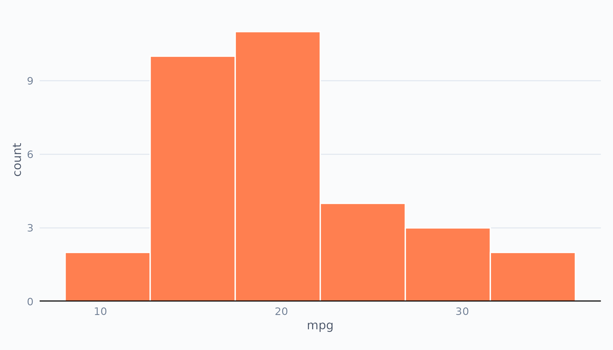

# Getting Started with ekioplot

``` r

library(ekioplot)
library(ggplot2)
```

## EKIO Theme

[`theme_ekio()`](https://viniciusoike.github.io/ekioplot/reference/theme_ekio.md)
applies EKIO’s visual identity to any ggplot2 plot. It builds on
[`theme_minimal()`](https://ggplot2.tidyverse.org/reference/ggtheme.html)
with curated typography, spacing, and color choices.

``` r

ggplot(mtcars, aes(wt, mpg)) +
  geom_point(color = ekio_blue["700"], size = 2.5) +
  labs(
    title = "Fuel Efficiency vs. Weight",
    subtitle = "Motor Trend Car Road Tests (1974)",
    x = "Weight (1000 lbs)",
    y = "Miles per Gallon"
  ) +
  theme_ekio()
```



The `grid` parameter controls which major grid lines are drawn:

``` r

ggplot(mtcars, aes(wt, mpg)) +
  geom_point(color = ekio_blue["700"]) +
  theme_ekio(grid = "xy")
```



Use
[`theme_ekio_map()`](https://viniciusoike.github.io/ekioplot/reference/theme_ekio_map.md)
for spatial visualizations — it removes axes and repositions the legend.

## Color Palettes

ekioplot ships with ~30 palettes across five categories. Use
[`list_ekio_palettes()`](https://viniciusoike.github.io/ekioplot/reference/list_ekio_palettes.md)
to explore them:

``` r

str(list_ekio_palettes())
#> List of 5
#>  $ categorical: chr [1:7] "cool" "minimal" "contrast" "full" ...
#>  $ small_group: chr [1:6] "duo_warm" "duo_cool" "trio_bold" "trio_cool" ...
#>  $ scientific : chr [1:4] "okabe_ito" "viridis" "inferno" "plasma"
#>  $ sequential : chr [1:8] "blue" "teal" "gray" "orange" ...
#>  $ diverging  : chr [1:3] "blue_orange" "blue_red" "teal_orange"
```

Access any palette with
[`ekio_pal()`](https://viniciusoike.github.io/ekioplot/reference/ekio_pal.md):

``` r

ekio_pal("contrast")
#> [1] "#1E3A5F" "#DD6B20" "#2C7A7B" "#D69E2E" "#805AD5" "#C53030"
ekio_pal("blue", n = 5)
#> [1] "#EEF5FA" "#D4E8F5" "#A8D0E8" "#7EB6D8" "#4A90C2"
```

### Palette types

- **Categorical**: `contrast`, `cool`, `minimal`, `full`, `muted`,
  `binary`, `political`
- **Small-group**: `duo_warm`, `duo_cool`, `trio_bold`, `trio_cool`,
  `quad_earth`, `quad_vivid`
- **Scientific**: `okabe_ito`, `viridis`, `inferno`, `plasma`
- **Sequential**: `blue`, `teal`, `gray`, `orange`, `purple`, `red`,
  `green`, `amber`
- **Diverging**: `blue_orange`, `blue_red`, `teal_orange`

Visualize any palette with
[`show_ekio_palette()`](https://viniciusoike.github.io/ekioplot/reference/show_ekio_palette.md):

``` r

show_ekio_palette("contrast")
```



## Scale Functions

ekioplot provides ggplot2 scales for both discrete and continuous data.

### Discrete scales

``` r

ggplot(mtcars, aes(wt, mpg, color = factor(cyl))) +
  geom_point(size = 3) +
  scale_color_ekio_d("contrast") +
  labs(color = "Cylinders") +
  theme_ekio(grid = "xy")
```



### Continuous scales

Sequential and diverging palettes work with continuous data:

``` r

ggplot(mtcars, aes(wt, mpg, color = hp)) +
  geom_point(size = 3) +
  scale_color_ekio_c("blue") +
  labs(color = "Horsepower") +
  theme_ekio(grid = "xy")
```



Fill variants are available as
[`scale_fill_ekio_d()`](https://viniciusoike.github.io/ekioplot/reference/scale_color_ekio_d.md)
and
[`scale_fill_ekio_c()`](https://viniciusoike.github.io/ekioplot/reference/scale_color_ekio_c.md).

## Recipe Functions

Recipe functions are high-level wrappers that create complete,
publication-ready plots with smart defaults.

### Histogram

``` r

ekio_histogram(mtcars, mpg)
```



### Bar plot

``` r

cyl_counts <- as.data.frame(table(cyl = mtcars$cyl))
names(cyl_counts)[2] <- "n"
ekio_barplot(cyl_counts, cyl, n)
```



### Scatter plot

``` r

ekio_scatterplot(mtcars, wt, mpg, color = factor(cyl))
```



### Area plot

``` r

data(fuels)
world_fuels <- fuels[fuels$entity == "World" & fuels$year >= 1950, ]
ekio_areaplot(world_fuels, year, consumption_gwh, fill = fuel)
```



### Smart aesthetic detection

Recipe functions automatically detect whether the color/fill argument
is:

- **Missing** — uses EKIO blue as default
- **A color string** (e.g., `"steelblue"`) — uses that color directly
- **A variable** — maps it and applies the appropriate EKIO scale

``` r

ekio_histogram(mtcars, mpg, fill = "coral")
```



## Color Scales

Four named color scales are exported for direct use: `ekio_blue`,
`ekio_gray`, `ekio_teal`, and `ekio_orange`. Each provides 10 shades
from `"50"` (lightest) to `"900"` (darkest).

``` r

ekio_blue["700"]
#>       700 
#> "#1E3A5F"
ekio_gray["300"]
#>       300 
#> "#E2E8F0"
```

Named accent colors are available in `ekio_accent`:

``` r

ekio_accent
#>      blue    orange      teal     amber    purple       red     green      gray 
#> "#1E3A5F" "#DD6B20" "#2C7A7B" "#D69E2E" "#805AD5" "#C53030" "#38A169" "#718096"
```

## GT Tables

Apply EKIO styling to gt tables with
[`gt_theme_ekio()`](https://viniciusoike.github.io/ekioplot/reference/gt_theme_ekio.md):

``` r

library(gt)

head(mtcars[, 1:5], 8) |>
  gt() |>
  gt_theme_ekio(add_footer = FALSE)
#> Warning: Character vector names are ignored. Instead of a named character
#> vector, use a named list to define Sass variables.
#> Warning: Character vector names are ignored. Instead of a named character
#> vector, use a named list to define Sass variables.
#> Warning: Character vector names are ignored. Instead of a named character
#> vector, use a named list to define Sass variables.
#> Warning: Character vector names are ignored. Instead of a named character
#> vector, use a named list to define Sass variables.
#> Warning: Character vector names are ignored. Instead of a named character
#> vector, use a named list to define Sass variables.
#> Warning: Character vector names are ignored. Instead of a named character
#> vector, use a named list to define Sass variables.
#> Warning: Character vector names are ignored. Instead of a named character
#> vector, use a named list to define Sass variables.
#> Warning: Character vector names are ignored. Instead of a named character
#> vector, use a named list to define Sass variables.
#> Warning: Character vector names are ignored. Instead of a named character
#> vector, use a named list to define Sass variables.
#> Warning: Character vector names are ignored. Instead of a named character
#> vector, use a named list to define Sass variables.
#> Warning: Character vector names are ignored. Instead of a named character
#> vector, use a named list to define Sass variables.
#> Warning: Character vector names are ignored. Instead of a named character
#> vector, use a named list to define Sass variables.
#> Warning: Character vector names are ignored. Instead of a named character
#> vector, use a named list to define Sass variables.
#> Warning: Character vector names are ignored. Instead of a named character
#> vector, use a named list to define Sass variables.
#> Warning: Character vector names are ignored. Instead of a named character
#> vector, use a named list to define Sass variables.
#> Warning: Character vector names are ignored. Instead of a named character
#> vector, use a named list to define Sass variables.
#> Warning: Character vector names are ignored. Instead of a named character
#> vector, use a named list to define Sass variables.
#> Warning: Character vector names are ignored. Instead of a named character
#> vector, use a named list to define Sass variables.
#> Warning: Character vector names are ignored. Instead of a named character
#> vector, use a named list to define Sass variables.
```

| mpg  | cyl | disp  | hp  | drat |
|------|-----|-------|-----|------|
| 21.0 | 6   | 160.0 | 110 | 3.90 |
| 21.0 | 6   | 160.0 | 110 | 3.90 |
| 22.8 | 4   | 108.0 | 93  | 3.85 |
| 21.4 | 6   | 258.0 | 110 | 3.08 |
| 18.7 | 8   | 360.0 | 175 | 3.15 |
| 18.1 | 6   | 225.0 | 105 | 2.76 |
| 14.3 | 8   | 360.0 | 245 | 3.21 |
| 24.4 | 4   | 146.7 | 62  | 3.69 |
